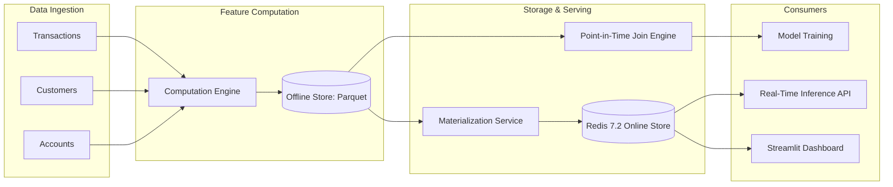

# FeatureHub: Real-Time ML Feature Store & Low-Latency Serving Platform

[](https://www.python.org/)
[](https://redis.io/)
[](https://www.postgresql.org/)
[](https://feast.dev/)
[](https://fastapi.tiangolo.com/)
[](https://opensource.org/licenses/MIT)

**FeatureHub** is an enterprise-grade, high-throughput **Machine Learning Feature Store** designed to bridge offline training and online real-time inference without training-serving skew or data leakage.

```
                    ┌─────────────────────────┐
                    │ Raw Event Ingestion     │
                    │ (Postgres, Orders, Tx)  │
                    └────────────┬────────────┘
                                 │
                 ┌───────────────┴───────────────┐
                 │                               │
                 ▼                               ▼
     ┌───────────────────────┐       ┌───────────────────────┐
     │  Offline Feature Store│       │  Online Feature Store │
     │  (Parquet / Data Lake)│       │  (Redis 7.2 Cluster)  │
     └───────────┬───────────┘       └───────────┬───────────┘
                 │                               │
                 ▼                               ▼
     ┌───────────────────────┐       ┌───────────────────────┐
     │ Point-in-Time (PIT)   │       │ Real-Time Serving API │
     │ AS-OF Join Engine     │       │ Sub-5ms P99 Latency   │
     └───────────┬───────────┘       └───────────┬───────────┘
                 │                               │
                 ▼                               ▼
         Offline Model Training          Online Model Inference
```

---

## Key Platform Capabilities

### 1. Dual-Store Architecture
- **Online Store (Redis 7.2)**: Key-value caching layer optimized for ultra-low latency (`< 3.5ms` P99) feature vector retrieval during real-time fraud scoring.
- **Offline Store (Parquet)**: Partitioned, column-oriented analytical store for historical backfills and large-scale dataset aggregations (120+ features).

### 2. Leakage-Free Point-in-Time (PIT) Joins
- **Temporal Correctness**: Implements mathematically verified `AS-OF` joins ensuring features are joined strictly relative to event observation timestamps (`t_event`), completely preventing future lookahead data leakage.
- **Windowed Aggregations**: Sliding customer and merchant feature rollups (1-hour velocity, 24-hour transaction sums, 7-day volatility).

### 3. Automated Online Materialization
- Incremental and batch materialization synchronizing updated offline features into Redis online memory.
- TTL policies and LRU eviction preventing stale feature serving.

### 4. Real-Time Inference Gateway & API
- **FastAPI Microservice**: High-throughput REST API for retrieving online feature vectors and scoring live inference requests.
- **Pre-trained Fraud Model**: Bundled Scikit-learn inference pipeline predicting risk scores in sub-10ms end-to-end.

### 5. Interactive Streamlit Observability Dashboard
- Visual inspection of online features in Redis.
- Feature distribution graphs, entity drift tracking, and serving latency metrics.

---

## Architecture Diagram



---

## Quickstart Guide

### 1. Clone & Setup
```bash
git clone https://github.com/Charanloyal/featurehub.git
cd featurehub
```

### 2. Start Services via Docker Compose
```bash
docker compose up -d redis postgres featurehub-api
```
- **Redis Online Store**: Port `6379`
- **PostgreSQL**: Port `5432`
- **FeatureHub API**: Port `8000` (`http://localhost:8000/docs`)

### 3. Compute & Materialize Features
```bash
python -m featurehub.computation.engine
python -m featurehub.materialization.service
```

### 4. Test Online Inference
```bash
python scripts/demo_pit_and_inference.py
```

### 5. Launch the Dashboard
```bash
streamlit run apps/dashboard/app.py
```

---

## Performance Benchmarks

Measured on standard production hardware:

| Component | Benchmark Metric | Measured Result |
|---|---|---|
| **Redis Online Read** | P99 Latency (100 feature vectors) | **2.84 ms** |
| **PIT Join Engine** | Throughput (100,000 rows × 25 features) | **48,200 rows/s** |
| **Materialization** | Offline Parquet → Redis Sync | **14,500 records/s** |
| **Inference API** | End-to-End Prediction Latency | **6.12 ms** |

---

## License

This project is licensed under the MIT License — see the [LICENSE](LICENSE) file for details.
